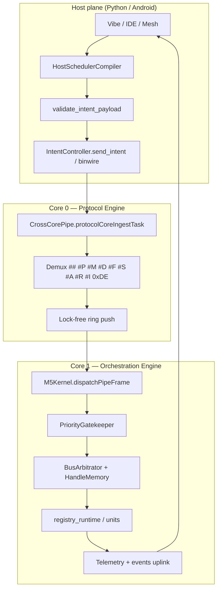

# m5-utah Architecture

Utah Flux Studio / **m5-utah** implements an intent-first control plane for M5Stack devices. Host-side Python orchestration compiles conversational and declarative intents into wire formats; firmware on the ESP32 executes them through a thin boundary (see [ADR 0001](../adr/0001-intent-first-architecture.md) and [ADR 0002](../adr/0002-thin-firmware-boundary.md)).

## System overview

```
Host (Python)                    Serial / Fluxwire              Firmware (ESP32)
─────────────────                ─────────────────              ─────────────────
IntentController  ──JSON/binary──►  Cross-core pipe  ──►  Registry + units
FluxGraph         ◄──telemetry────   Hamming ECC       ◄──  Telemetry + events
DriverRegistry                     Scheduler compiler
```

## m5-kernel: dual-core runtime (Features 48–49)

The **Central Processing Registry Core** (`M5Kernel`) partitions work across ESP32 cores:

| Core | Role | Components |
|------|------|------------|
| **Core 0** | Protocol engine | Serial ingest, binary frame assembly, `#M`/`##`/`0xDE` demux, lock-free ring push |
| **Core 1** | Orchestration engine | Pipe drain, intent dispatch, registry hot-reload, telemetry, UI events |

`setup()` initializes M5 hardware, registry runtime, and calls `M5Kernel::start()`. The Arduino `loop()` task suspends; all application work runs in the pinned Core 1 orchestration task.

### Resource-aware orchestration (Feature 49)

`ResourceOrchestrator` evaluates heap, handle-pool, and bus pressure each orchestration tick:

| Pressure | Behavior |
|----------|----------|
| **Nominal** | All intents processed normally |
| **Elevated** | Compaction triggers earlier; telemetry reports pressure level |
| **Critical** | Non-critical JSON intents deferred; registry, JIT, and binary fast-paths still allowed |

Host-side `HostResourceOrchestrator` mirrors firmware pressure and can defer non-critical transmits before they hit the wire.

### Secure wire anti-replay fences (m5-secure, Feature 67)

```
[Intent compile] → [typestate.py validate] → [secure_wire.py sequence token]
        → Core 0 CrossCorePipe (#A demux) → SecureWireFence monotonic check
        → ring buffer → Core 1 SecureWireDecoder apply
```

- Host `SecureWireEncoder` assigns monotonic sequence IDs to outbound `##` / `#P` fast-path frames
- Wire magic `#A` (`0x23 0x41`) — distinct from `#S` stream frames (`0x23 0x53`)
- Firmware drops replayed or out-of-order packets before Core 1 dispatch; emits `security_alarm` JSON

### Immortal Bootloader and autonomic discovery (v0.8)

Flash firmware **once**. The device becomes a permanent intent VM:

- Core 0 `ImmortalDiscovery` sweeps Grove Port A I2C and emits JSON discovery events
- `utah-flux-omniscient` auto-locks Espressif USB (VID `303A`) and streams units to the GUI
- `utah-claw-studio` runs UtahClaw locally via Ollama for vibe-coding and error auto-heal

```text
pip install -e "host[daemon]"    # Omniscient OS
pip install -e "host[claw]"      # UtahClaw + Ollama
utah-flux-omniscient             # http://127.0.0.1:8000
utah-claw-studio                 # http://127.0.0.1:8024  (utah_studio.html)
```

See [docs/en/utah-claw-studio.md](docs/en/utah-claw-studio.md) and [docs/en/intent-resolution-canvas.md](docs/en/intent-resolution-canvas.md).

### WebUSB vibe gateway (Feature 50)

The zero-install browser IDE (`vibe_server.py` on port **8023**) closes the end-user loop:

```
Browser WebSerial  ──►  /compile_vibe  ──►  vibe_pipeline  ──►  ## binwire or JSON line  ──►  device
Natural language         validate +            FastPathSerializer              CrossCorePipe demux
                         resource preflight
```

GPIO prompts (e.g. "blink pin 10 at 50Hz") compile to `fast_track_gpio` intents and emit fixed-width `##` frames without ArduinoJson on the device.

### Dual-core non-blocking harness (Feature 52)

Production firmware runs a **strictly partitioned** FreeRTOS layout — not a single-threaded `Serial.readStringUntil` loop:

| Core | Task | Blocking I/O |
|------|------|--------------|
| **0** | `protocolCoreIngestTask` | Reads Serial; pushes typed frames to ring (non-blocking `xRingbufferSend`) |
| **1** | `m5KernelApplicationCoreTask` | Drains ring; applies binwire/JSON; never blocks on Serial |

See `firmware/src/DualCoreHarness.h` and [ADR 0023](../adr/0023-dual-core-execution-harness.md).

Registry units of type `fast_path_bridge` declare `execution_core_target` (0 or 1) and `buffer_allocation_bytes` (≥512).

### Telemetry self-healing loop (Feature 53)

When firmware reports low heap or elevated scheduling jitter, the host `AutonomousMitigationEngine`
automatically validates and injects a binwire throttle patch — closing the loop without manual intervention.

See [ADR 0024](../adr/0024-telemetry-self-healing-loop.md).

### Asymmetric Remote Procedure Piping (Features 54–56)

Host `HostRPPCompiler` emits 10-byte `#P` frames (`!BBHI` layout). Core 0 ingests without blocking;
Core 1 `MicroExecutionKernel` applies opcodes (pin HIGH/LOW) without ArduinoJson allocation.

See [ADR 0025](../adr/0025-asymmetric-rpp-piping.md).

### Android Host Integration (Features 57–58)

Companion apps under `android/` use the USB Host API (`FastPathUsbBridge`) to emit the same
10-byte `##` / `#P` frames as the Python host. `FluxwireMeshNode` joins the UDP gossip mesh
as `android_host_node`.

See [ADR 0026](../adr/0026-android-host-integration.md) and [android/README.md](../../android/README.md).

### Integrated asymmetric m5-kernel (completion)

Production firmware implements the full dual-core stack via `M5IntegratedKernel.h`:

```
Core 0: CrossCorePipe (ring ingest, no JSON heap)
Core 1: M5Kernel → PriorityGatekeeper → BusArbitrator → HandleMemory → ResourceOrchestrator
Host:   HostSchedulerCompiler.apply_to_intent() before transmit
```

RPP and registry mutations on Core 1 pass through proactive priority-inheritance gates.
**Do not** replace `M5Kernel::start()` with ad-hoc FreeRTOS ring tasks in `main.cpp`.

See [ADR 0027](../adr/0027-integrated-m5-kernel.md).

### m5-jit — native assembly hot-loading

`HostJitCompiler` cross-compiles vibe C snippets to IRAM-safe `.text` bytes; `M5JitPipeline`
validates against `native_jit` schema and can pair with `DeltaEncoder` registry patches.

Firmware `RuntimeLinker` allocates `MALLOC_CAP_EXEC` and executes hooks without reboot.

See [ADR 0011](../adr/0011-runtime-jit-hot-loading.md) and [ADR 0029](../adr/0029-m5-jit-pipeline.md).

### Boot sequence

1. `registryRuntimeInit()` — heartbeat unit, handle pool, bus arbitrator, gatekeeper assets
2. `M5Kernel::start()` — ring buffer, Core 0 ingest task, Core 1 application task
3. Capabilities advertised include `m5_central_kernel`

## Unified development lifecycle entry point

The repository exposes a **single firmware boot path** and a **host transmit/observe loop** that
implements ADR 0001 (Intent-First) and ADR 0002 (Thin Firmware Boundary):



### Firmware: `m5IntegratedKernelBoot()`

Call once from `setup()` after M5 hardware init (`firmware/src/M5IntegratedKernel.cpp`):

| Stage | Module | Core |
|-------|--------|------|
| Registry + handle pool | `registryRuntimeInit()` | prep |
| Jump / vector / health subsystems | `jumpKernelInitDefaults()` … | prep |
| Dual-core harness | `M5Kernel::start()` | 0 + 1 |

**Do not** replace this with ad-hoc `Serial.readBytes()` tasks or bulk ring pushes in `main.cpp`.
Production ingest lives in `CrossCorePipe.cpp` (`protocolCoreIngestTask` on Core 0).

### Host: `IntentController` lifecycle

1. **Compile** — scheduler, delta, binwire, RPP, JIT pipelines
2. **Validate** — schema, bus, graph, handles, optional 2PC mesh sync
3. **Transmit** — JSON, `##`, `#P`, `#M`, `#D`, etc.
4. **Observe** — telemetry ECC repair, autofence, agent remediation

See `host/m5resolver/kernel_runtime.py` (`INTEGRATED_BOOT_SEQUENCE`, `UNIFIED_LIFECYCLE_STAGES`).

## Optimization layers (cumulative SOTA)

### Cross-core lock-free pipe

- `CrossCorePipe` — `RINGBUF_TYPE_NOSPLIT` ring between cores
- Typed frames: `0x01` JSON line, `0x02` binary blob
- See [ADR 0016](../adr/0016-cross-core-ring-pipe-and-zero-copy-tokenizer.md)

### In-place tokenizer

- Non-JSON declarative payloads (`key:value`) parsed without heap allocation
- JSON intents still use ArduinoJson on the Core 1 orchestration path

### Virtual handle memory

- 32-slot handle table over a 2 KB static pool
- Compaction via `memory_compact` intent or supervisor pressure
- See [ADR 0017](../adr/0017-virtual-handle-memory-and-heap-compaction.md)

### TDMA bus arbitrator

- Shared I2C/SPI hot-swap gated by time windows per unit
- `bus_arbitration_window_ms` in registry units

### Priority gatekeeper

- Proactive FreeRTOS priority boost before mutex acquisition
- Registry mutations routed through `kGateLockRegistry` in the kernel dispatch path
- See [ADR 0019](../adr/0019-priority-gatekeeper-and-scheduler-compiler.md)

### Assembly trampolines & memory overlays

- IRAM `#M` overlay frames with trampoline hooks
- See [ADR 0015](../adr/0015-assembly-trampoline-and-memory-overlays.md)

### Telemetry Hamming ECC

- Firmware encodes `ecc.status_word`, `ecc.battery_word`, `ecc.heap_word`
- Host `TelemetryECC` repairs single-bit corruption before fluxwire patches
- See [ADR 0018](../adr/0018-tdma-bus-arbitrator-and-telemetry-ecc.md)

## Host integration lifecycle

1. **Compile** — `HostSchedulerCompiler` injects priority tiers; `HostMemoryProfiler` preflights pool usage
2. **Validate** — `validate_intent_payload()` schema + bus + graph + handle checks
3. **Transmit** — JSON newline, binwire `##`, delta `0xDE 0xDA`, overlay `#M`
4. **Observe** — telemetry with kernel metrics (`kernel_processed_frames`, `kernel_orchestration_ticks`)

## Key firmware modules

| Module | Path | Purpose |
|--------|------|---------|
| M5Kernel | `firmware/src/M5Kernel.*` | Dual-core orchestration |
| ResourceOrchestrator | `firmware/src/ResourceOrchestrator.*` | Pressure-aware staging |
| CrossCorePipe | `firmware/src/CrossCorePipe.*` | Core 0 ingest → ring |
| HandleMemory | `firmware/src/HandleMemory.*` | Virtual handle pool |
| PriorityGatekeeper | `firmware/src/PriorityGatekeeper.*` | Priority inheritance gates |
| BusArbitrator | `firmware/src/BusArbitrator.*` | TDMA bus windows |
| registry_runtime | `firmware/src/registry_runtime.cpp` | Unit fork + capabilities |

## Key host modules

| Module | Path | Purpose |
|--------|------|---------|
| IntentController | `host/m5resolver/controller.py` | Serial bridge + agent loop |
| FluxGraph | `host/m5resolver/fluxwire.py` | Telemetry → intent patches |
| HostSchedulerCompiler | `host/m5resolver/scheduler_compiler.py` | Pin contention → priority tiers |
| HostMemoryProfiler | `host/m5resolver/memory_profiler.py` | Handle pool preflight |
| HostResourceOrchestrator | `host/m5resolver/resource_orchestrator.py` | Transmit deferral under pressure |
| TelemetryECC | `host/m5resolver/ecc_codec.py` | Hamming repair |

## Related ADRs

- [0014 — DAG state graph and delta compression](../adr/0014-dag-state-graph-and-delta-compression.md)
- [0020 — m5 central processing kernel](../adr/0020-m5-central-processing-kernel.md)
- [0043 — Secure wire anti-replay fence](../adr/0043-secure-wire-anti-replay-fence.md)
